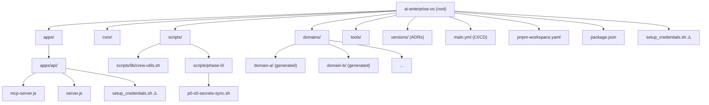
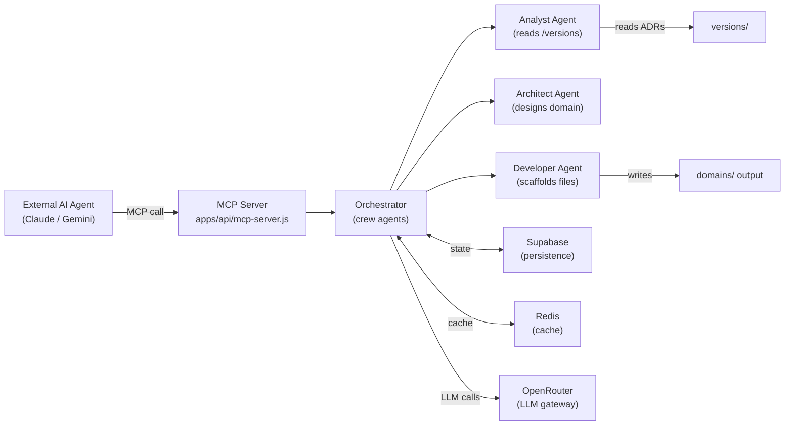
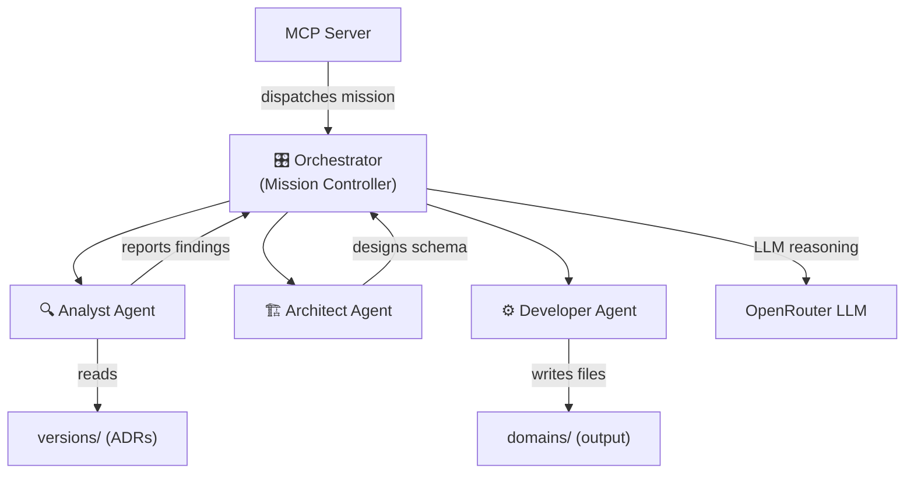
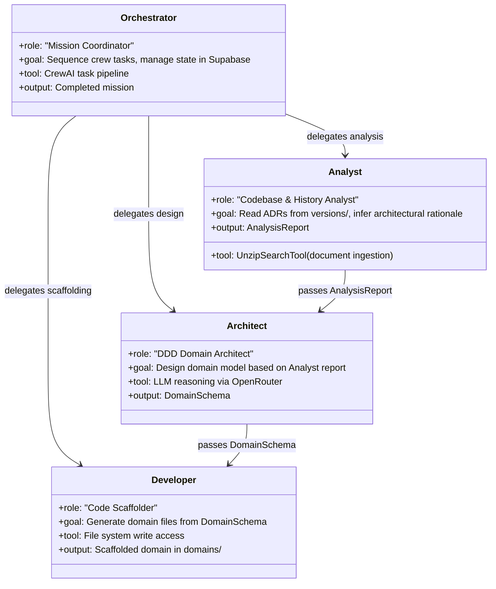

# AI Enterprise OS — Sovereign Factory: System Analysis

> **Repository**: `familiarcat/ai-enterprise-os`  
> **Branch**: `main` · **Commits**: 4  
> **Language split**: Shell 58% · JavaScript 28.3% · Python 13.7%  
> **Analysis date**: 2026-04-28

---

## 1. Project Overview

The **Sovereign Factory** is a self-maintaining, agentic business-unit generation engine built on Domain-Driven Design (DDD) principles. It operates as "Business-as-Code": given a mission, the system autonomously analyzes its own architectural history (via `/versions`), then scaffolds new Domain, Application, Infrastructure, and UI layers.

The system exposes itself via the **Model Context Protocol (MCP)**, allowing any MCP-compatible AI assistant (Claude, Gemini, etc.) to invoke factory operations programmatically.

### Core Capabilities

| Capability | Description |
|---|---|
| Autonomous Analysis | Agents audit `/versions` decision history to inform scaffolding |
| DDD Scaffolding | Auto-generates Domain → Application → Infra → UI layer stack |
| MCP Exposure | Factory tools consumable by external AI agents via MCP server |
| Workspace Integration | `pnpm` workspaces for shared utilities and recursive test runs |
| CI/CD | GitHub Actions pipeline (Node 20 + Python 3.11 + pnpm 8) |

---

## 2. Repository Structure

```
ai-enterprise-os/
├── apps/                    # Application surfaces (MCP server, API, UI)
│   └── api/
│       ├── mcp-server.js    # MCP entrypoint (agent-facing)
│       ├── server.js        # Express dev server
│       └── setup_credentials.sh  ⚠️ (also duplicated at root — see §4)
├── core/                    # Shared core utilities and base types
├── domains/                 # DDD domain packages (auto-scaffolded)
├── scripts/                 # Operational shell scripts
│   ├── lib/
│   │   └── crew-utils.sh   # Shared zshrc/env helpers
│   └── phase-0/
│       └── p0-s0-secrets-sync.sh  # GitHub Secrets sync
├── tools/                   # CLI tools; added to PATH via setup
├── versions/                # Architectural decision records (ADRs)
├── main.yml                 # GitHub Actions CI/CD workflow
├── orchestrator.test.js     # Vitest test suite (orchestrator)
├── package.json             # Root workspace manifest (v28.2-integrated)
├── pnpm-workspace.yaml      # Workspace: apps/*, domains/*, packages/*, core
└── setup_credentials.sh     # ⚠️ Root-level credential script (see §4)
```

### Structural Diagram



### Data Flow



---

## 3. Critical Systems Analysis

### 3.1 Security Violations

#### 🔴 CRITICAL — Hardcoded Absolute Path in Version-Controlled Script

**File**: `setup_credentials.sh` (root)

```sh
ZSHRC="/Users/bradygeorgen/.zshrc"
PROJECT_PATH="/Users/bradygeorgen/Dev/ai-enterprise-os"
```

This hardcodes a specific developer's home directory into a committed shell script. Any collaborator, CI runner, or agent that executes this script will fail immediately. This also leaks the developer's local username and filesystem layout publicly.

**Fix**:
```sh
PROJECT_PATH="$(cd "$(dirname "$0")" && pwd)"
ZSHRC="${HOME}/.zshrc"
```

---

#### 🔴 CRITICAL — `setup_credentials.sh` Duplicated at Root AND `apps/api/`

The README instructs users to run `zsh ./apps/api/setup_credentials.sh`, but the root also contains `setup_credentials.sh`. These can diverge silently. It's unclear which is canonical.

**Fix**: Remove the root copy; establish `apps/api/setup_credentials.sh` as the single source and update all references.

---

#### 🟡 WARNING — `exec zsh` at Script End

```sh
echo "🚀 Refreshing your shell session to apply changes..."
exec zsh
```

`exec zsh` replaces the current shell process. This terminates the calling shell, which breaks any parent script, CI pipeline, or terminal session that called this script. In a CI context (GitHub Actions), this would kill the runner process.

**Fix**: Remove `exec zsh`. Use `source ~/.zshrc` only where necessary and document the manual reload step.

---

#### 🟡 WARNING — Duplicated Supabase Key Validation Block

In `setup_credentials.sh`, the Supabase JWT format check is copy-pasted twice identically (lines ~38–44 and ~46–52). This is dead/redundant code and a maintenance hazard.

---

#### 🟡 WARNING — `main.yml` Workflow Not in `.github/workflows/`

The GitHub Actions CI/CD file is named `main.yml` and sits at the **repository root**, not at `.github/workflows/main.yml`. GitHub Actions will **never execute this file** in its current location. CI is effectively non-functional.

**Fix**: Move to `.github/workflows/main.yml`.

---

#### 🟡 WARNING — `pnpm-workspace.yaml` References `packages/*` (Non-Existent Directory)

```yaml
packages:
  - 'apps/*'
  - 'domains/*'
  - 'packages/*'   # ← no /packages directory exists in the repo
  - 'core'
```

The `packages/*` glob references a directory that does not appear in the repository tree. This creates a dangling workspace reference. pnpm will silently ignore it, but it can cause confusion and tool errors.

---

#### 🟡 WARNING — `tools/` in PATH Without `.gitignore` Audit

The `setup_credentials.sh` adds `$PROJECT_PATH/tools` to the user's `$PATH` globally. If any binary in `/tools` is unvetted or world-writable, this is a local privilege escalation vector. The `tools/` directory contents are not visible at the repository root listing level for verification.

---

### 3.2 Unused / Suspect Files

| File | Status | Reason |
|---|---|---|
| `main.yml` (root) | ⚠️ Orphaned | Not in `.github/workflows/` — GitHub never runs it |
| `setup_credentials.sh` (root) | ⚠️ Likely Redundant | Duplicates `apps/api/` version; unclear which is canonical |
| `packages/` workspace glob | ⚠️ Dead Reference | Directory does not exist in repo |
| `versions/` | ❓ Unverified | Critical for agent analysis loop; contents not publicly visible |

---

### 3.3 Dependency Analysis

From `package.json`:

| Package | Purpose | Risk Note |
|---|---|---|
| `@modelcontextprotocol/sdk ^0.6.0` | MCP agent interface | Early version; API surface may be unstable |
| `@supabase/supabase-js ^2.39.0` | Persistence layer | Stable |
| `dotenv ^16.6.1` | Env management | Stable |
| `express ^4.18.2` | HTTP server | Stable; consider v5 eventually |
| `ioredis ^5.3.2` | Redis cache client | Stable |
| `vitest ^1.6.1` | Test runner | Stable |
| `pydantic`, `crewai` | Python crew agents (CI-only) | Installed at CI time, not locked in `pyproject.toml` or `requirements.txt` — **no version pinning** |

**Risk**: Python dependencies (`crewai`, `pydantic`) are installed via a bare `pip install` in CI with no version constraints. This makes builds non-deterministic and fragile.

---

## 4. The Crew — Agentic Roles

Based on the README, CI workflow, and overall system design, the platform defines three primary crew agent personas (implemented in Python via CrewAI).

### Role Overview



### Agent Role Definitions



### Crew Responsibility Matrix

| Agent | Input | Output | Persistence | LLM Required |
|---|---|---|---|---|
| **Orchestrator** | MCP mission payload | Sequenced task results | Supabase (mission state) | No |
| **Analyst** | `/versions` ADR files | Structured analysis report | Redis (cache) | Yes (OpenRouter) |
| **Architect** | Analysis report | DDD domain schema | Redis (cache) | Yes (OpenRouter) |
| **Developer** | Domain schema | Files in `domains/` | File system | Optionally |

---

## 5. Next Steps & Recommendations

### 5.1 Immediate — Security & Correctness

**P0 — Fix the CI/CD pipeline**
Move `main.yml` to `.github/workflows/main.yml`. The entire automated pipeline is currently inert.

**P0 — Decouple hardcoded paths**
Replace all absolute paths in `setup_credentials.sh` with dynamic resolution. This is a blocker for any collaborator or CI runner.

**P0 — Canonicalize the credential script**
Delete the root-level `setup_credentials.sh`. The `apps/api/` version should be the single source. Update README accordingly.

**P1 — Pin Python dependencies**
Add a `requirements.txt` or `pyproject.toml` with locked versions of `crewai` and `pydantic`. CrewAI especially has a fast-moving API surface.

**P1 — Remove `exec zsh` from credential script**
Replace with a printed reminder: `echo "Run: source ~/.zshrc to apply changes"`.

**P1 — Clean up duplicate validation block**
Remove the second copy of the Supabase JWT validation block in `setup_credentials.sh`.

---

### 5.2 Near-Term — Architecture

**Create `packages/` or remove the workspace glob**
Either scaffold a real `packages/` directory (e.g., for shared TypeScript utilities) or remove the dead glob from `pnpm-workspace.yaml`.

**Audit `tools/` directory**
Document what executables live in `tools/`, add a `README.md` there, and ensure the directory is `.gitignored` for any generated binaries.

**Version-lock MCP SDK**
`@modelcontextprotocol/sdk ^0.6.0` is pre-1.0. Consider locking to an exact version (no `^`) until the protocol stabilizes.

**Establish a `.env.example`**
The system requires `OPENROUTER_API_KEY`, `SUPABASE_URL`, `SUPABASE_KEY`, `REDIS_URL`, `PYTHON_BIN`, and Vercel/EC2 deployment secrets. A committed `.env.example` with placeholder values makes onboarding significantly clearer without leaking secrets.

---

### 5.3 Strategic — Platform Evolution

**Implement `MissionConfig` schema**
Decouple any remaining hardcoded mission/business-unit references (the pattern from `openrouter-crew-platform`) into a dynamic `MissionConfig` stored in Supabase. This enables the factory to be truly vertical-agnostic.

**Add `versions/` ADR linting**
The Analyst agent depends on the quality of ADRs in `/versions`. Consider a lightweight ADR schema validator (JSON Schema or a markdown linter) to ensure new ADRs are machine-parseable.

**Establish integration tests for MCP tools**
The `orchestrator.test.js` (Vitest) likely unit-tests the orchestrator in isolation. Add a second test layer that fires real MCP tool calls against a local server instance to validate the full agentic loop end-to-end.

**Formalize the CrewAI task pipeline**
Move agent persona definitions out of ad-hoc scripts and into a `CREW_MANIFEST.yaml` or equivalent (mirroring the `CREW_PLATFORM_SYSTEM_PROMPT.md` pattern you've used in `openrouter-crew-platform`). This makes the crew inspectable by any MCP client without executing code.

---

## 6. Summary Risk Register

| ID | Severity | Item | Status |
|---|---|---|---|
| S-01 | 🔴 Critical | Hardcoded absolute paths in committed script | Open |
| S-02 | 🔴 Critical | `main.yml` not in `.github/workflows/` — CI inert | Open |
| S-03 | 🔴 Critical | Duplicate `setup_credentials.sh` — canonical version unclear | Open |
| S-04 | 🟡 Warning | `exec zsh` kills caller shell / CI runner | Open |
| S-05 | 🟡 Warning | Duplicate Supabase validation block (dead code) | Open |
| S-06 | 🟡 Warning | No Python dependency pinning (`crewai`, `pydantic`) | Open |
| S-07 | 🟡 Warning | `packages/*` workspace glob — directory non-existent | Open |
| S-08 | 🟡 Warning | `tools/` on PATH without documented content audit | Open |
| A-01 | 🔵 Info | MCP SDK pre-1.0 — API instability risk | Monitor |
| A-02 | 🔵 Info | No `.env.example` — onboarding friction | Open |
| A-03 | 🔵 Info | `versions/` ADR quality unvalidated | Open |
